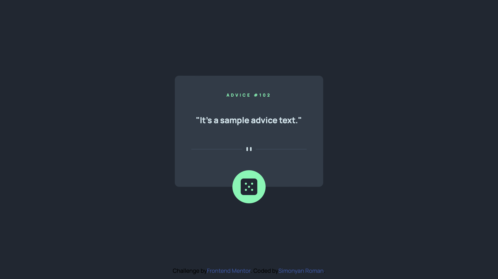
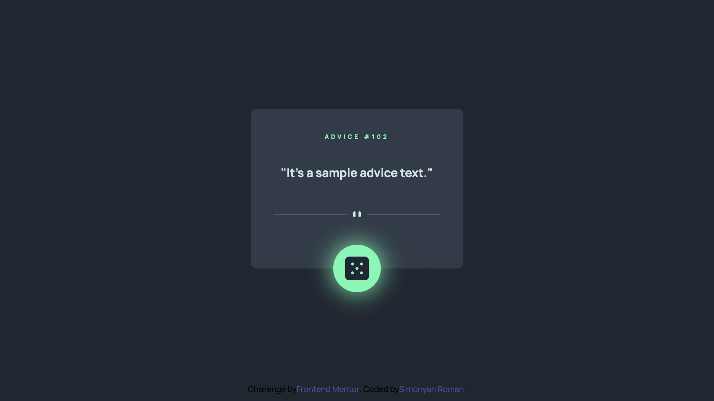

# Frontend Mentor - Advice generator app solution

This is a solution to the [Advice generator app challenge on Frontend Mentor](https://www.frontendmentor.io/challenges/advice-generator-app-QdUG-13db). Frontend Mentor challenges help you improve your coding skills by building realistic projects.

## Table of contents

- [Overview](#overview)
  - [The challenge](#the-challenge)
  - [Screenshot](#screenshot)
  - [Links](#links)
- [My process](#my-process)
  - [Built with](#built-with)
  - [What I learned](#what-i-learned)
  - [Continued development](#continued-development)
  - [Useful resources](#useful-resources)
- [Author](#author)
- [Acknowledgments](#acknowledgments)

**Note: Delete this note and update the table of contents based on what sections you keep.**

## Overview

### The challenge

Users should be able to:

- View the optimal layout for the app depending on their device's screen size
- See hover states for all interactive elements on the page
- Generate a new piece of advice by clicking the dice icon

### Screenshot





### Links

- Solution URL: [Add solution URL here](https://your-solution-url.com)
- Live Site URL: [Add live site URL here](https://your-live-site-url.com)

## My process

### Built with

- Semantic HTML5 markup
- CSS custom properties
- Flexbox
- Mobile-first workflow

### What I learned

I learned how to work with simple APIs.

API fetching inside async functions. And writing response to JSON.

```js
async function request() {
  const response = await fetch("https://api.adviceslip.com/advice");
  const data = await response.json();
}
```

Reading data from JSON objects.

```js
async function request() {
  const response = await fetch("https://api.adviceslip.com/advice");
  const data = await response.json();

  retrieved_id = data.slip.id;
  retrieved_advice = data.slip.advice;
}
```

### Continued development

I'm looking forward to train my skill in working with different usefull APIs. I'm just not yet as familiar with this theme as i should, so i work hard to be more proficient.

### Useful resources

- (https://livecodestream.dev/post/http-requests-in-javascript/) - Here i found all basic explanations aboit implementing API fetching into my project.

## Author

- Website - [Simonyan Roman](https://www.linkedin.com/in/simonyanrr)

## Acknowledgments

Dot notation is very cool and easy.
